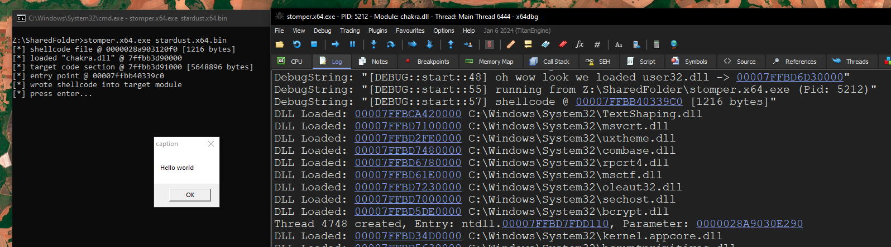
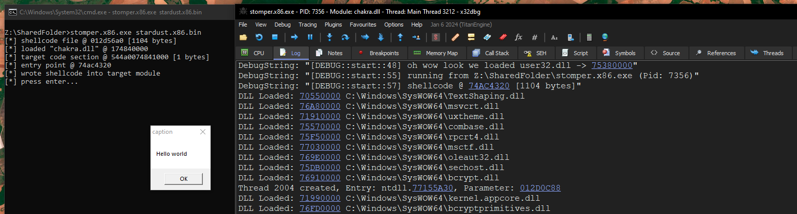

# Stardust

A modern and easy to use 32/64-bit shellcode template.

- raw strings 
- C++20 project 
- uses compile time hashing with fnv1a for both function and module resolving  

### Basic Usage

resolving modules from PEB using `resolve::module`:
```c++
if ( ! (( ntdll.handle = resolve::module( expr::hash_string<wchar_t>( L"ntdll.dll" ) ) )) ) {
    return;
}

if ( ! (( kernel32.handle = resolve::module( expr::hash_string<wchar_t>( L"kernel32.dll" ) ) )) ) {
    return;
}
```

resolving function apis using either `RESOLVE_API` macro or `resolve::api` function:
```c++
const auto user32 = kernel32.LoadLibraryA( symbol<const char*>( "user32.dll" ) );

decltype( MessageBoxA ) * msgbox = RESOLVE_API( reinterpret_cast<uintptr_t>( user32 ), MessageBoxA );

msgbox( nullptr, symbol<const char*>( "Hello world" ), symbol<const char*>( "caption" ), MB_OK );
```
The `RESOLVE_API` is a wrapper around `resolve::api` to automatically hashes the function name and cast the function pointer to the function type.

string hashing for both UTF-8 and UTF-16 using the compile time `expr::hash_string` function:
```c++
auto user32_hash      = expr::hash_string<wchar_t>( L"user32.dll" );
auto loadlibrary_hash = expr::hash_string<char>( "LoadLibraryA" );
```

raw strings support for both 32/64-bit by using the `symbol` function: 
```c++
auto caption_string = symbol<const char*>( "hello from stardust" );

user32.MessageBoxA( nullptr, caption_string, symbol<const char*>( "message title" ), MB_OK );
```

easy to add new apis and modules to the instance. Under `include/common.h` the following entry has to be made:
```c++
class instance {
    ...
    
    struct
    {
        uintptr_t handle; // base address to user32.dll

        struct {
            D_API( MessageBoxA );
            // more entries can be added here
        };
    } user32 = {
        RESOLVE_TYPE( MessageBoxA ),
        // more entries can be added here 
    };
    
    ...
```
while the ``src/main.cc`` should resolve the base address of user32 and resolve the api pointer:
```c++

declfn instance::instance(
    void
) {
    ...
    //
    // resolve user32.dll from PEB if loaded 
    if ( ! (( user32.handle = resolve::module( expr::hash_string<wchar_t>( L"user32.dll" ) ) )) ) {
        return;
    }

    //
    // automatically resolve every entry imported
    // by user32 from the structure 
    RESOLVE_IMPORT( user32 );
    ...
}

```

semi friendly debugging capabilities via DbgPrint. The project althought needs to be compiled in debug mode by specifying ``make debug``. Usage: 
```c++
const auto user32 = kernel32.LoadLibraryA( symbol<const char*>( "user32.dll" ) );

if ( user32 ) {
    DBG_PRINTF( "oh wow look we loaded user32.dll -> %p\n", user32 );
} else {
    DBG_PRINTF( "okay something went wrong. failed to load user32 :/\n" );
}

DBG_PRINTF( "running from %ls (Pid: %d)\n",
    NtCurrentPeb()->ProcessParameters->ImagePathName.Buffer,
    NtCurrentTeb()->ClientId.UniqueProcess );

DBG_PRINTF( "shellcode @ %p [%d bytes]\n", base.address, base.length );
```

### Building 

Build in release mode: 
```shell
$ make                                                                                                                                                                                                                                                                                  20:17:26
-> compiling src/main.cc to main.x64.obj
-> compiling src/resolve.cc to resolve.x64.obj
compiling x64 project
/usr/bin/x86_64-w64-mingw32-ld: bin/stardust.x64.exe:.text: section below image base
-> compiling src/main.cc to main.x86.obj
-> compiling src/resolve.cc to resolve.x86.obj
compiling x86 project
/usr/bin/i686-w64-mingw32-ld: bin/stardust.x86.exe:.text: section below image base
$ ll bin                                                                                                                                                                                                                                                                                20:57:10
drwxr-xr-x spider spider 4.0 KB Thu Mar 13 20:57:10 2025 obj
.rw-r--r-- spider spider 752 B  Thu Mar 13 20:57:10 2025 stardust.x64.bin
.rw-r--r-- spider spider 672 B  Thu Mar 13 20:57:10 2025 stardust.x86.bin
```

Build in debug mode: 
```shell
$ make debug                                                                                                                                                                                                                                                                            20:57:14
-> compiling src/main.cc to main.x64.obj
-> compiling src/resolve.cc to resolve.x64.obj
compiling x64 project
/usr/bin/x86_64-w64-mingw32-ld: bin/stardust.x64.exe:.text: section below image base
-> compiling src/main.cc to main.x86.obj
-> compiling src/resolve.cc to resolve.x86.obj
compiling x86 project
/usr/bin/i686-w64-mingw32-ld: bin/stardust.x86.exe:.text: section below image base
$ ll bin                                                                                                                                                                                                                                                                                20:58:13
drwxr-xr-x spider spider 4.0 KB Thu Mar 13 20:58:13 2025 obj
.rw-r--r-- spider spider 1.2 KB Thu Mar 13 20:58:13 2025 stardust.x64.bin
.rw-r--r-- spider spider 1.1 KB Thu Mar 13 20:58:13 2025 stardust.x86.bin
```

## Demo
x64:


x86:

